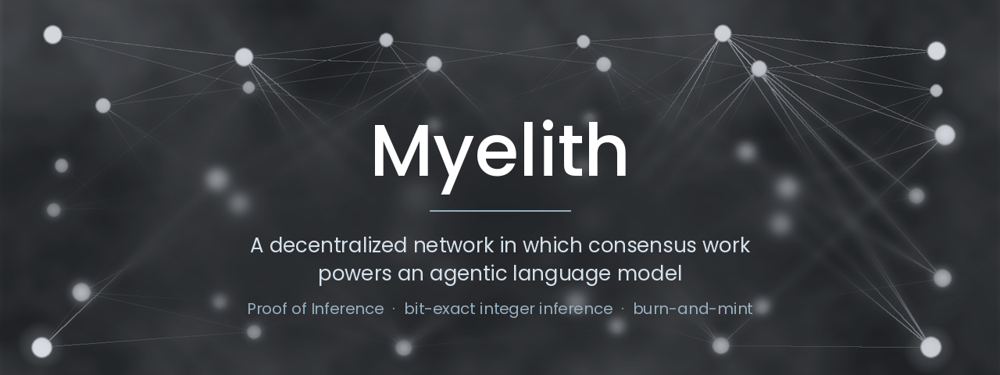

Dieses README ist auch auf [Deutsch](README.md) verfügbar.

## AI System Disclosure (EU AI Act Art. 50)

This is an **AI system**. Interactions with this software are with an
artificial intelligence, not a human. The system generates synthetic text
and synthetic speech; generated speech is marked as AI-generated, both
machine-readably and in the signal.

## Regulatory Information

- **EU AI Act (EU) 2024/1689 status:** non-high-risk AI system
  (self-assessed per Annex III)
- **Self-assessment, article by article:** [COMPLIANCE/en/Self-Assessment.md](COMPLIANCE/en/Self-Assessment.md)
- **GPAI documentation:** [COMPLIANCE/en/GPAI-Documentation.md](COMPLIANCE/en/GPAI-Documentation.md)
- **Training data summary:** [COMPLIANCE/en/Training-Data.md](COMPLIANCE/en/Training-Data.md)
- **Intended use policy:** [COMPLIANCE/en/Intended-Use-Policy.md](COMPLIANCE/en/Intended-Use-Policy.md)
- **Copyright policy:** [COMPLIANCE/en/Copyright-Policy.md](COMPLIANCE/en/Copyright-Policy.md)
- **Third-party components and licences:** [COMPLIANCE/NOTICES.md](COMPLIANCE/NOTICES.md)
- **Everything, in German and English:** [COMPLIANCE](COMPLIANCE/README.md)

## Prohibited Uses

This system must not be used for any high-risk application as defined in
Annex III of the EU AI Act, nor for any practice prohibited by Article 5.
See the [intended use policy](COMPLIANCE/en/Intended-Use-Policy.md) for
the full list.

---

## What this project is about

**Myelith makes consensus work useful.** The same computation that secures
the network runs a large agentic language model. Not a burned crypto game
(proof-of-work), but inference somebody can actually use, and
**checkable**: because it runs entirely in integer arithmetic, independent
nodes produce bit-identical results.

**For scale:** Bitcoin consumes roughly **150 terawatt-hours of
electricity per year** according to the
[Cambridge index](https://ccaf.io/cbnsi/cbeci), more than the Netherlands
in total, and the output of that work is a useless number nobody outside
the blockchain can use. Myelith turns that energy into inference somebody
ordered and paid for!

The native coin MYL closes the loop: users burn it for inference credits
and miners receive newly minted MYL in proportion to verified work.

The complete architecture, tokenomics, and verification model are set out
in **Whitepaper v0.3**:
[German (MD)](README/Whitepaper/myelith-whitepaper-v0.3.md) ·
[German (PDF)](README/Whitepaper/myelith-whitepaper-v0.3.pdf) ·
[English (MD)](README/Whitepaper/myelith-whitepaper-v0.3-en.md) ·
[English (PDF)](README/Whitepaper/myelith-whitepaper-v0.3-en.pdf).
Every technical term, from the bisection game to fixed-point arithmetic,
is explained in the **[glossary](README/Glossary.en.md)**, with pointers
to the corresponding implementation.

---

## Where the project stands

Eight weeks turned a planning phase in early August into **26 crates,
a running node and a client.**

| | |
|---|---|
| **Core thesis proven** | Integer inference costs **+1.1 % perplexity at 7B**; the bar was ≤ 5 %, and it also runs correctly through an **MoE model with 30B parameters** and through a **hybrid model with 35B** in which 30 of 40 layers are recurrent state layers |
| **And it is fast** | At 7B the integer path is **faster than bf16** on the same machine |
| **Runs locally** | A window and a console for macOS, Windows and Linux: model inference and an agent with tools and skills are ready |
| **The network runs** | Nodes find each other over QUIC, work behind home routers, build blocks, let latecomers catch up |
| **State converges** | Three processes, thirteen blocks, **identical state roots at every height** |
| **Security** | 15 attack classes reviewed: **10 defended, 4 with a named residual condition** |
| **Cost** | **1.9× a centralized provider at 7B**, and nearly all of that is redundancy |

---

## Core thesis

Integer addition is associative. If inference is executed entirely in
integer arithmetic, bit-identity arises between independent nodes, the
foundation of the entire verification architecture (Whitepaper Chap. 6).
That this also holds in quality has been measured: first on the small
model, then on larger ones.

**Results,** executed entirely in integer arithmetic and measured against
the floating-point reference of the same model:

| Model | Integer perplexity | BF16 reference | Gap |
|---|---|---|---|
| Qwen3-0.6B | 43.49 | 42.26 | **+2.9 %**, criterion ≤5 % met |
| Qwen3-4B | 19.95 | 19.63 | **+1.6 %**, criterion ≤5 % met |
| Qwen3-8B | 13.27 | 12.79 | **+3.8 %**, criterion ≤5 % met |
| Qwen3-30B-A3B (MoE) | 10.42 | 10.48 | **no measurable gap**, criterion met |
| Qwen3.6-35B-A3B (hybrid) | 9060.93 | 8613.28 | **+5.2 %** \* |

\* Preliminary value: the perplexity floor of this model has not been measured yet.

*The metric is perplexity on WikiText-2 under teacher forcing, on identical
sequences for both paths; lower is better. "Gap" is the relative premium the
integer path pays over its own BF16 reference. On Qwen2.5-7B that figure is **+1.1 %**,
which puts it **0.3 percentage points above the theoretical floor of the
quantisation scheme itself** (+0.84 %, measured independently).*

**Bit-identity here is not a side effect, it is the product.** What matters
is the agreement of the integer path with itself: across independent runs,
nodes, and hardware. No tolerance windows, no "reproducible within
measurement error", no trust in individual operators. Bit for bit or not
at all.

Closeness to the floating-point reference comes out better than the
percentage suggests. In the
[qualitative benchmark](INTEGER_LLM/README/README.md#qualitative-benchmark)
over eight real prompts, 7B produces word-for-word the same text as BF16
in five of eight cases, at 73.8 % matching tokens. That is a quality
figure, not a target: 8/8 would not be a success but a hint that the
quantisation does nothing. Details in the
[whitepaper (Chap. 6.9)](README/Whitepaper/myelith-whitepaper-v0.3-en.md)
and in [INTEGER_LLM](INTEGER_LLM/README/README.md).

## Architecture

**Three of four layers run on the network; the fourth runs locally.**

| Layer | Task | Status |
|---|---|---|
| **L3 Agent Layer** | Agentic workflows, tool use, session contracts | **runs locally**: the agent loop with tools, skills and loop on your own machine. On the network the session contracts act on the chain: budget, recipients and deadline are immutable to the agent; the runtime that executes a plan on the network is still missing |
| **L2 Compute Layer** | Model shards, pods, pipeline routing, redundancy | **running**, bit-identical across 1 to 24 shards, Mixture-of-Experts models included |
| **L1 Consensus Layer** | BFT, PoI aggregation, staking, slashing | **running**, largely complete: BFT across five independent processes, chained blocks, signed instructions |
| **L0 Networking Layer** | P2P gossip, latency topology, NAT traversal | **running**, with relays and QUIC; the channels are end-to-end encrypted and will carry the activations next |

Also: **TOKENOMICS** largely built, **GOVERNANCE** with the parameter
registry, **TRAINING** with data provenance and the growth operator,
**STORAGE** with proof of availability and a storage fee, **GATEWAY** as
the way into the network, and a **CLIENT** that runs locally.

## Components

Every component has its own folder with design decisions and tests.
The short version here:

| Component | What it delivers |
|---|---|
| [INTEGER_LLM](INTEGER_LLM/README/README.md) | **The core thesis, measured.** Integer inference at **+1.14 % at 7B** (bar: ≤ 5 %), only 0.3 points above what the quantisation scheme allows at all; for the **30B Mixture-of-Experts model** (128 experts per layer) no measurable gap, and a **hybrid 35B model** also runs through in integers. Throughput **+419 % at 7B**, faster than bf16. Plus the training side: backward pass, bit-identical across two runs, saturation guard, expert growth. The [scale pack](INTEGER_LLM/scale_packs/README.md) makes artefact builds bit-identical, 1.8 MB instead of 8.8 GB, 40 s instead of 20 min |
| [NODE](NODE/README/README.md) | **The binary that runs the protocol.** Peers over TCP and QUIC, relays behind routers, chained blocks from a mempool, catch-up in milliseconds, signature checks, block height and epoch separated, an analysable operating log. Demonstrated on five independent processes committing the same block and surviving leader failure |
| [NETWORKING](NETWORKING/README/README.md) | **L0 stands.** Gossip, Kademlia, latency topology, NAT traversal with AutoNAT, relays, DCUtR, QUIC. Connection limits with **separate budgets** against Sybil floods. Point-to-point channel with opaque payload: the network layer does not know what a block is. Sessions end-to-end encrypted, key exchange **hybrid** from X25519 and ML-KEM-768: recordings stay safe against later breaking |
| [STORAGE](STORAGE/README/README.md) | **Where the weights come from.** The Store role: holds artefacts and shard weights, proves their availability and is paid for it. Object format, proof of availability and storage fee are in place; whether an object is replicated or erasure-coded is deliberately left open until real retrieval traffic measures the latency |
| [CONSENSUS](CONSENSUS/README/README.md) | **Largely complete.** Signed, stake-weighted BFT with VRF committee selection, double-signing proof and round change, so safety **and** liveness, verified on 21 validators. Plus PoI bundles, epoch close, Reed-Solomon, session contracts in state. An instruction without a signature has no effect. The algorithm change becomes a switch, not a migration |
| [VERIFICATION](VERIFICATION/README/README.md) | **Three stages against fraud.** Redundancy comparison, bisection in O(log L), control segments against the one-off intervention, reserve and observation window as parameters. The paper's security arguments are **measured against the implementation**: collusion bound to three digits, independence within 0.01 %. The instrument for indistinguishability stands ready and awaits real traffic |
| [TOKENOMICS](TOKENOMICS/README/README.md) | **Largely built, and integer throughout.** Minting, distribution, credit pricing, stake by capacity, graduated slashing over a violation history, bootstrap, genesis, burn cap per address. "No presale" is not checked but **enforced by how the function works**: it accepts proofs of work and nothing else. Every number in the paper stands as a test |
| [COMPUTE_PIPELINE](COMPUTE_PIPELINE/README/README.md) | **Pods compute bit-identically.** 1 to 24 shards yield the same digest over logits and tokens as a single node, Mixture-of-Experts models included. Failover with standby takeover and bit-identical KV cache rebuild, only possible in integers at all. Which miner gets which shard is decided by the scheduler, not by an assumption |
| [SHARED_TYPES](SHARED_TYPES/README/README.md) | **The foundation.** VRF, BLS with proof-of-possession, Merkle, erasure coding over GF(2⁸), verified across **all 495** subsets of 8 from 12. The Merkle root also commits to the leaf count, otherwise two different leaf sequences could share one root. The [threat model for all seven signature uses](SHARED_TYPES/README/Signatur-Bedrohungsmodell.md) is written up |
| [TESTCLIENT](TESTCLIENT/README/README.md) | **One program, one menu, three questions.** Does your machine compute what ours does, does it hold the conformance vectors, and do several machines find each other over the internet? The comparison **refuses** a positive verdict when all logs come from the same machine: a tool that confirms itself is no tool |
| [GOVERNANCE](GOVERNANCE/README/README.md) | **Parameters in one place, with rank.** 33 parameters with provenance and rank; the constitutional rank from Chap. 10.3 is enforced **technically**. Nine conditions are checked **on the proposal**, not after the vote. Plus voting with quorum, majority and window, a model manifest, and the switch for the algorithm change: one-way, one step |
| [TRAINING](TRAINING/README/README.md) | **Integer training holds, and that is measured.** **+0.67 %** against floating point, with stochastic rounding, **entirely without floating-point state**. Growth exactly function-preserving, 0.00e+00. For Mixture-of-Experts models likewise, with load balancing without randomness |
| [SIMULATION](SIMULATION/README.md) | **Tests the interlocks, not the modules.** Drives a segment through every layer, because almost every serious finding in this project sat between two components and was correct inside each |
| [COMPLIANCE](COMPLIANCE/README.md) | **What the law requires, and commitments that rule things out.** AI Act self-assessment, intended use policy, GPAI documentation, training data, copyright and `NOTICES`, in German and English; below it [`ethics`](COMPLIANCE/ethics/README/README.md) with the manifesto, the exclusion catalogue and the licence review per model variant, and the fixed system prompt with the assistant's rules of conduct |
| [AGENT_LAYER](AGENT_LAYER/README/README.md) | ⚑ **A contract is not a program, it is a blast radius.** Budget, recipients and deadline are fixed and checked by consensus; nobody can change them, because a different contract has a different address. Alongside it the agent loop that runs locally, announcing and executing the model's tools |
| [GATEWAY](GATEWAY/README/README.md) | **The way into the network.** Accepts requests and records what came in; the session contract is the access key |
| [CLIENT](CLIENT/README/README.md) | **The component people actually touch.** A chat window and a console for macOS, Windows and Linux: choose and load a model, ask, attach files, and let an agent work with tools, skills and loop, all on your own machine. The network half (wallet, node state, session limits) is waiting for a reachable network |

## Security status

A [security audit](SIMULATION/Sicherheitsaudit.md) takes up the attack
classes from Whitepaper Chap. 5.6 and 9.2, fifteen by now. **Since 25 August not a
single one is marked open (an external audit follows after the remaining
tests and troubleshooting):**

| Status | Count |
|---|---|
| defended and evidenced | **10** |
| closed, with a named residual condition | **4** |
| never externally reviewed | 1 |

The four residual conditions share one shape. The mechanism is in place
and measured; the last prerequisite depends on validator registration at
genesis. Since early September, coverage-guided fuzzing of the wire
formats and a dependency check in CI run alongside.

## What comes next

Four things, ordered by priority:

1. **Hardware support for CUDA and ROCm.** Today the integer path runs
   on the CPU and on Apple GPUs (METAL); NVIDIA and AMD cards will follow
   soon.
2. **From local operation to the network.** The client currently runs
   locally only; the network options are greyed out.
3. **Production genesis with validator registration.** Unlocks the last
   residual conditions of the audit and is the final stage before a
   testnet.
4. **External cryptography review.** Before mainnet, of course.

**What runs today is a dry run, not a testnet.** The state is throwaway,
the MYL in it is play money, and the starting value of the rehearsal
chain says so in plain text. When the testnet begins is a
decision, not a consequence of the code running.

## License

[PolyForm Shield License 1.0.0](LICENSE.md). Using, modifying, and
commercially participating in the Myelith network (mining, validation,
gateways, clients) is permitted; operating a competing network or product
based on the code is not.
