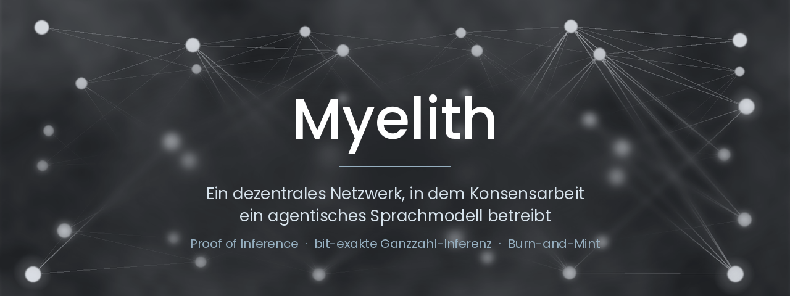

Dieses README ist auch auf [Englisch](README.en.md) verfügbar.

**Myelith macht Konsensarbeit nützlich.** Dieselbe Rechenleistung, die das
Netzwerk sichert, betreibt ein großes agentisches Sprachmodell. Kein verbranntes Krypto- Spielchen (Proof-of-Work), sondern Inferenz, die jemand gebrauchen kann, und zwar **nachprüfbar**: Weil sie vollständig ganzzahlig läuft, liefern unabhängige Knoten bitgleiche Ergebnisse.

**Zum Größenverhältnis:** Bitcoin verbraucht nach dem
[Cambridge-Index](https://ccaf.io/cbnsi/cbeci) rund **150 Terawattstunden
Strom im Jahr**, mehr als die Niederlande insgesamt, und das Ergebnis
dieser Arbeit ist eine unnütze Zahl, die außerhalb der Blockchain niemand gebrauchen kann. Myelith setzt diese Energie in Inferenz um, die jemand bestellt und bezahlt!

Der native Coin MYL schließt den Kreislauf: Nutzer verbrennen ihn gegen
Inferenz-Credits und Miner erhalten neu geprägte MYL im Verhältnis zur
verifizierten Arbeit.

Die vollständige Architektur, Tokenomics und das Verifikationsmodell
stehen im **Whitepaper v0.3**:
[Deutsch (MD)](README/Whitepaper/myelith-whitepaper-v0.3.md) ·
[Deutsch (PDF)](README/Whitepaper/myelith-whitepaper-v0.3.pdf) ·
[English (MD)](README/Whitepaper/myelith-whitepaper-v0.3-en.md) ·
[English (PDF)](README/Whitepaper/myelith-whitepaper-v0.3-en.pdf).
Alle Fachbegriffe, vom Bisektions-Spiel bis zur Festkomma-Arithmetik,
erklärt das **[Glossar](README/Glossar.md)**, mit Verweisen auf die
jeweilige Implementierung.

---

## Wo das Projekt steht

Aus einer Planungsphase Anfang August sind in drei Wochen **sechzehn
Crates, rund 1200 Tests und ein laufender Knoten** geworden.

| | |
|---|---|
| **Kernthese belegt** | Ganzzahl-Inferenz kostet **+1,1 % Perplexität bei 7B**, Kriterium war ≤ 5 % |
| **Und sie ist schnell** | Bei 7B ist der Integerpfad **schneller als bf16** auf derselben Maschine |
| **Netz läuft** | Knoten finden einander über QUIC, arbeiten hinter Heimroutern, bauen Blöcke, holen Nachzügler auf |
| **Zustand konvergiert** | Drei Prozesse, dreizehn Blöcke, **identische Zustandswurzeln auf jeder Höhe** |
| **Sicherheit** | 13 Angriffsklassen geprüft: **8 abgewehrt, 4 mit benannter Restbedingung, 0 offen** |
| **Kosten** | **1,9× gegenüber einem zentralen Anbieter bei 7B**, und davon ist fast alles Redundanz |

---

## Kernthese

Ganzzahladdition ist assoziativ. Wird Inferenz vollständig in
Ganzzahlarithmetik ausgeführt, entsteht Bitgleichheit zwischen unabhängigen
Knoten, die Grundlage der gesamten Verifikationsarchitektur (Whitepaper
Kap. 6). Ob das bei realistischer Modellgröße auch qualitativ trägt, ist
eine offene Messfrage; das Projekt beantwortet sie zuerst am kleinen
Modell, bevor Infrastruktur skaliert wird.

**Ergebnisse,** vollständig ganzzahlig ausgeführt und gegen die
Gleitkomma-Referenz desselben Modells gemessen:

| Modell | Integer-Perplexität | BF16-Referenz | Abstand |
|---|---|---|---|
| Qwen2.5-0,5B | 15,27 | 14,95 | **+2,1 %**, Kriterium ≤5 % erfüllt |
| Qwen2.5-7B | **8,78** | 8,68 | **+1,1 %**, Kriterium ≤5 % erfüllt |

*Gemessen wird Perplexität auf WikiText-2 mit Teacher-Forcing, für beide
Pfade auf identischen Sequenzen; niedriger ist besser. „Abstand" ist der
relative Aufschlag des Integer-Pfads auf seine eigene BF16-Referenz.
Bei 7B lag dieser Wert vor den Fehlersuchen bei **+377 %**
(Perplexität 41,42), heute bei **+1,1 %** und damit **0,3 Prozentpunkte
über dem theoretischen Boden des Quantisierungsschemas** (+0,84 %,
unabhängig gemessen).

**Bitgleichheit ist hier kein Nebeneffekt, sondern das Produkt.** Worauf es
ankommt, ist die Übereinstimmung des Integer-Pfads mit sich selbst: über
unabhängige Läufe, Knoten und Hardware hinweg. Keine Toleranzfenster, kein
„reproduzierbar im Rahmen der Messgenauigkeit", kein Vertrauen in einzelne
Betreiber. Bit für Bit oder gar nicht.

Die *Nähe zur Gleitkomma-Referenz* fällt dabei besser aus, als der
Prozentwert vermuten lässt. Im
[qualitativen Benchmark](INTEGER_LLM/README/README.md#qualitativer-benchmark)
über acht echte Prompts liefert 7B dennoch in fünf von acht Fällen Wort für
Wort denselben Text wie BF16, bei 73,8 % deckungsgleichen Token. Das ist eine
Gütezahl, kein Zielwert: 8/8 wäre kein Erfolg, sondern der Hinweis, dass die
Quantisierung wirkungslos ist. Details im
[Whitepaper (Kap. 6.9)](README/Whitepaper/myelith-whitepaper-v0.3.md) und in
[INTEGER_LLM](INTEGER_LLM/README/README.md).

## Architektur

Vier Schichten (Whitepaper Kap. 3.2), ergänzt durch Tokenomics,
Training und Governance:

**Drei von vier Schichten laufen, unter Vorbehalt.**

| Schicht | Aufgabe | Stand |
|---|---|---|
| **L3 Agent Layer** | Agentische Workflows, Tool-Use, Session-Kontrakte | Entwurf. Wartet auf die Schichten darunter |
| **L2 Compute Layer** | Modell-Shards, Pods, Pipeline-Routing, Redundanz | **läuft**, bitgleich über 1 bis 24 Shards |
| **L1 Consensus Layer** | BFT, PoI-Aggregation, Staking, Slashing | **läuft**, alle vier Phasen abgeschlossen. Über das Netz getrieben wird der Konsens mit der Validator-Registrierung |
| **L0 Networking Layer** | P2P-Gossip, Latenztopologie, NAT-Überwindung | **läuft**, einschließlich Relais und QUIC. Die verschlüsselten Aktivierungs-Streams sind der nächste Ausbau |

Außerdem: **TOKENOMICS** vollständig, **GOVERNANCE** mit
Parameter-Registry, **TRAINING** mit Datenprovenienz und
Wachstumsoperator.

## Komponenten

Jede Komponente hat einen eigenen Ordner mit Fahrplan,
Design-Entscheidungen und Tests. Die Kurzfassung hier:

| Komponente | Was sie leistet |
|---|---|
| [INTEGER_LLM](INTEGER_LLM/README/README.md) | **Die Kernthese, gemessen.** Ganzzahl-Inferenz zu **+1,14 % bei 7B** (Kriterium ≤ 5 %), nur 0,3 Punkte über dem theoretischen Floor des Quantisierungsschemas. Durchsatz zuletzt **+419 % bei 7B** durch Zeilen-Parallelisierung: Der Integerpfad ist damit **schneller als bf16**. Das [Skalenpaket](INTEGER_LLM/scale_packs/README.md) macht den Artefaktbau plattformübergreifend bitgleich, 1,8 MB statt 8,8 GB, 40 Sekunden statt 20 Minuten |
| [NODE](NODE/README/README.md) | **Das Binary, das das Protokoll ausführt.** Neu seit dem 24. August. Findet Gegenstellen über TCP und QUIC, arbeitet hinter Netzwerk-Routern über Relais, baut verkettete Blöcke aus einem Mempool, lässt Nachzügler in Millisekunden aufholen, prüft Signaturen und schreibt ein auswertbares Betriebsprotokoll. Belegt an echten Prozessen |
| [NETWORKING](NETWORKING/README/README.md) | **L0 steht.** Gossip, Kademlia, Latenztopologie, NAT-Überwindung mit AutoNAT, Relais, DCUtR und QUIC. Verbindungsgrenzen mit **getrennten Budgets**, sodass eine Sybil-Flut die selbst gewählten Plätze nicht aufzehren kann. Punkt-zu-Punkt-Kanal für Nachforderungen, mit undurchsichtiger Nutzlast: Die Netzschicht weiß nicht, was ein Block ist, und soll es nicht wissen |
| [CONSENSUS](CONSENSUS/README/README.md) | **Alle vier Phasen abgeschlossen.** Signiertes, stimmgewichtetes BFT mit VRF-rotierender Komiteewahl, Double-Signing-Beweis und Rundenwechsel, also Safety **und** Liveness, geprüft an 21 simulierten Validatoren. Dazu PoI-Bündel, Epochenabschluss, Datenverfügbarkeit über Reed-Solomon. Der Ledger trägt Invarianten-Tests über zufällige Übergangsfolgen |
| [VERIFICATION](VERIFICATION/README/README.md) | **Drei Stufen gegen Betrug.** Redundanzvergleich, Bisektion in O(log L), Kontrollsegmente gegen den einmaligen Eingriff. Die beiden Sicherheitsargumente des Whitepapers sind **an der Implementierung gemessen** statt nachgerechnet: Die Kollusionsschranke trifft auf drei Stellen genau, die behauptete Unabhängigkeit hält mit 0,01 % Abweichung |
| [TOKENOMICS](TOKENOMICS/README/README.md) | **Fahrplan vollständig.** Prägung, Verteilung, Credit-Preisbildung, Stake nach beanspruchter Kapazität, gestaffeltes Slashing, Anlaufphase, Genesis-Verteilung. Vollständig ganzzahlig. „Kein Vorverkauf" wird nicht geprüft, sondern **durch die Arbeitsweise der Funktion durchgesetzt**: Sie nimmt Arbeitsnachweise und sonst nichts. Jede Zahl des Papiers steht als Test |
| [COMPUTE_PIPELINE](COMPUTE_PIPELINE/README/README.md) | **Pods rechnen bitgleich.** 1 bis 24 Shards liefern denselben Digest über Logits und Token wie der Einzelknoten. Ausfallsicherung mit Standby-Übernahme und bitgleichem KV-Cache-Rebuild, was nur ganzzahlig überhaupt möglich ist. Der Vergütungspfad ist seit v0.9.0 durchgängig |
| [SHARED_TYPES](SHARED_TYPES/README/README.md) | **Das Fundament.** VRF, BLS mit Proof-of-Possession, Merkle, Erasure-Codierung über GF(2⁸), geprüft über **alle 495** Teilmengen von 8 aus 12. Das [Bedrohungsmodell aller sieben Signaturverwendungen](SHARED_TYPES/README/Signatur-Bedrohungsmodell.md) liegt schriftlich vor, zur Vorbereitung des externen Kryptografie- Audits |
| [TESTCLIENT](TESTCLIENT/README/README.md) | **Das Werkzeug für die nächsten Tests.** Ein Programm, ein Menü, zwei Tests: Rechnet dein Rechner dasselbe wie unserer, und finden mehrere Rechner einander über das Internet? `vergleich` **verweigert** ein positives Urteil, wenn alle Protokolle von derselben Maschine stammen. |
| [GOVERNANCE](GOVERNANCE/README/README.md) | **Parameter an einem Ort, mit Rang.** 27 Parameter mit Fundstelle und Änderbarkeits-Rang; der Verfassungsrang aus Kap. 10.3 wird **technisch** durchgesetzt. Acht Sicherheitsbedingungen werden **am Vorschlag** geprüft, nicht erst nach der Abstimmung. Krypto-Agilität für die Post-Quantum-Migration ist verankert |
| [TRAINING](TRAINING/README/README.md) | **Die eine Messung ist gemacht: Es trägt.** Ganzzahliges Training zu **+0,67 %** gegenüber Gleitkomma, mit stochastischem Runden. Der Trainingsschritt kommt **ganz ohne Gleitkommazustand** aus. Wachstum ist exakt funktionserhaltend, Abweichung 0,00e+00 |
| [SIMULATION](SIMULATION/README.md) | **Prüft die Verzahnungen, nicht die Module.** Fährt ein Segment durch alle Schichten, weil fast jeder schwere Fund dieses Projekts zwischen zwei Komponenten saß und in jeder für sich korrekt war |
| [ETHICS](ETHICS/README/README.md) | Manifest v1.0.0 steht. **Grundsatz G7 ist für alle sieben Qwen2.5-Größen geprüft:** fünf davon Apache 2.0|
| [AGENT_LAYER](AGENT_LAYER/README/README.md) | Planungsphase, wartet auf die vorgelagerten Layer |
| [CLIENT](CLIENT/README/README.md) | Konzeptphase |

## Sicherheitsstand

Ein [Sicherheitsaudit](SIMULATION/Sicherheitsaudit.md) nimmt die dreizehn
Angriffsklassen aus Whitepaper Kap. 5.6 und 9.2 auf. **Seit dem
25. August steht dort kein einziges „offen" mehr (Externes Audit folgt nach den letzten Tests und Troubleshootings):**

| Stand | Zahl |
|---|---|
| abgewehrt und belegt | **8** |
| geschlossen, mit benannter Restbedingung | **4** |
| nie extern geprüft | 1 |

Die vier Restbedingungen haben dieselbe Form.
Der Mechanismus steht und ist gemessen, die letzte Voraussetzung hängt
an der Validator-Registrierung zu Genesis.

## Was als Nächstes kommt

Vier Dinge, nach Prio sortiert:

1. **Bitgleichheit über zwei Architekturen.** Sie folgt aus dem
   Zahlenformat und ist bislang auf einer Architektur gemessen. Der
   [TESTCLIENT](TESTCLIENT/README/README.md) ist für genau diesen
   Nachweis gebaut und wartet auf eine x86_64-Maschine.
2. **Validator-Registrierung zu Genesis.** Entblockt die BFT-Runden über
   das Netz und die letzten beiden Restbedingungen des Audits.
3. **Kettenzustand auf die Platte.** Heute im Speicher, was für
   Probeläufe reicht und für ein Testnetz nicht.
4. **Externes Kryptografie-Review.** Vor dem Mainnet, nicht danach.

**Was heute läuft, ist ein Dry-Run, kein Testnetz.** Der Zustand ist
Wegwerfware, die MYL darin sind Spielgeld, und der Startwert der
Probekette sagt das im Klartext. Wann das Testnetz beginnt, ist eine
Entscheidung und keine Folge davon, dass der Code läuft.

## Lizenz

[PolyForm Shield License 1.0.0](LICENSE.md). Nutzung, Veränderung und
kommerzielle Teilnahme am Myelith-Netzwerk (Mining, Validierung, Gateways,
Clients) sind erlaubt; ein konkurrierendes Netzwerk oder Produkt auf Basis
des Codes zu betreiben ist es nicht.