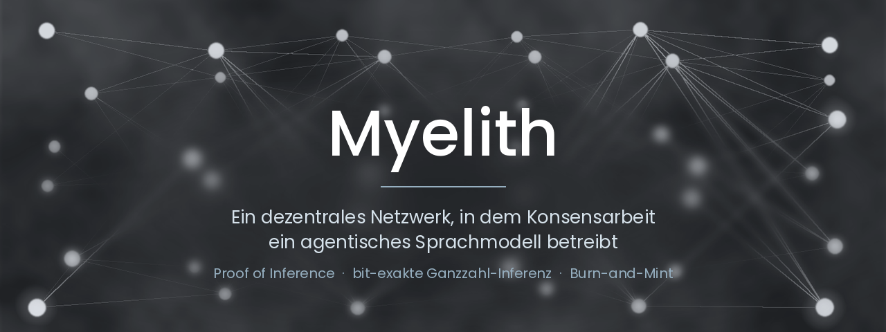

This README is also available in [english](README.en.md) language.

## Hinweis nach der KI-Verordnung (Art. 50)

Myelith ist ein **KI-System**. Wer damit arbeitet, arbeitet mit einer
künstlichen Intelligenz und nicht mit einem Menschen. Das System erzeugt
synthetische Texte und synthetische Sprache; erzeugte Sprache ist als
KI-erzeugt gekennzeichnet, maschinenlesbar und im Audio-Signal.

## Regulatorische Angaben

- **Einstufung nach der KI-Verordnung (EU) 2024/1689:** kein
  Hochrisiko-KI-System (Selbsteinschätzung nach Anhang III)
- **Selbsteinschätzung, Artikel für Artikel:** [COMPLIANCE/de/Selbsteinschaetzung.md](COMPLIANCE/de/Selbsteinschaetzung.md)
- **GPAI-Dokumentation:** [COMPLIANCE/de/GPAI-Dokumentation.md](COMPLIANCE/de/GPAI-Dokumentation.md)
- **Zusammenfassung der Trainingsdaten:** [COMPLIANCE/de/Trainingsdaten.md](COMPLIANCE/de/Trainingsdaten.md)
- **Zweckbestimmung:** [COMPLIANCE/de/Zweckbestimmung.md](COMPLIANCE/de/Zweckbestimmung.md)
- **Urheberrechtsstrategie:** [COMPLIANCE/de/Urheberrecht.md](COMPLIANCE/de/Urheberrecht.md)
- **Fremdkomponenten und Lizenzen:** [COMPLIANCE/NOTICES.md](COMPLIANCE/NOTICES.md)
- **Alles zusammen, deutsch und englisch:** [COMPLIANCE](COMPLIANCE/README.md)

## Verbotene Verwendungen

Myelith darf nicht für Hochrisiko-Anwendungen nach Anhang III der
KI-Verordnung und nicht für die nach Artikel 5 verbotenen Praktiken
verwendet werden. Die vollständige Liste steht in der
[Zweckbestimmung](COMPLIANCE/de/Zweckbestimmung.md).

---

## Worum es im Projekt geht

**Myelith macht Konsensarbeit nützlich.** Dieselbe Rechenleistung, die das
Netzwerk sichert, betreibt ein großes agentisches Sprachmodell. Kein verbranntes Krypto- Spielchen (Proof-of-Work), sondern Inferenz, die jemand gebrauchen kann, und zwar **nachprüfbar**: Weil sie vollständig ganzzahlig läuft, liefern unabhängige Knoten bitgleiche Ergebnisse.

**Zum Größenverhältnis:** Bitcoin verbraucht nach dem
[Cambridge-Index](https://ccaf.io/cbnsi/cbeci) rund **150 Terawattstunden
Strom im Jahr**, mehr als die Niederlande insgesamt. Und das Ergebnis
dieser Arbeit: eine unnütze Zahl, die außerhalb der Blockchain niemand gebrauchen kann. Myelith setzt diese Energie in Inferenz um, die jemand bestellt und bezahlt!

Der native Coin MYL schließt den Kreislauf: Nutzer verbrennen ihn gegen
Inferenz-Credits und Miner erhalten neu geprägte MYL im Verhältnis zur
verifizierten Arbeit.

Die vollständige Architektur, Tokenomics und das Verifikationsmodell
stehen im **Whitepaper v0.3**:
[Deutsch (MD)](README/Whitepaper/myelith-whitepaper-v0.3.md) ·
[Deutsch (PDF)](README/Whitepaper/myelith-whitepaper-v0.3.pdf) ·
[English (MD)](README/Whitepaper/myelith-whitepaper-v0.3-en.md) ·
[English (PDF)](README/Whitepaper/myelith-whitepaper-v0.3-en.pdf).
Alle Fachbegriffe, vom Bisektions-Spiel bis zur Festkomma-Arithmetik,
erklärt das **[Glossar](README/Glossar.md)**, mit Verweisen auf die
jeweilige Implementierung.

---

## Wo das Projekt steht

Aus einer Planungsphase Anfang August sind in acht Wochen **26 Crates,
ein laufender Node und ein Client** geworden.

| | |
|---|---|
| **Kernthese belegt** | Ganzzahl-Inferenz kostet **+1,1 % Perplexität bei 7B**, Kriterium war ≤ 5 %, und läuft auch korrekt durch ein **MoE-Modell mit 30B Parametern** und durch ein **hybrides Modell mit 35B**, in dem 30 von 40 Ebenen rekurrente Zustandsschichten sind |
| **Und sie ist schnell** | Bei 7B ist der Integerpfad **schneller als bf16** auf derselben Maschine |
| **Läuft lokal** | Fenster und Konsole für macOS, Windows und Linux: Modell-Inferenz und ein Agent mit Werkzeugen und Skills sind ready |
| **Netz läuft** | Knoten finden einander über QUIC, arbeiten hinter Heimroutern, bauen Blöcke, holen Nachzügler auf |
| **Zustand konvergiert** | Drei Prozesse, dreizehn Blöcke, **identische Zustandswurzeln auf jeder Höhe** |
| **Sicherheit** | 15 Angriffsklassen geprüft: **10 abgewehrt, 4 mit benannter Restbedingung** |
| **Kosten** | **1,9× gegenüber einem zentralen Anbieter bei 7B**, und davon ist fast alles Redundanz |

---

## Kernthese

Ganzzahladdition ist assoziativ. Wird Inferenz vollständig in
Ganzzahlarithmetik ausgeführt, entsteht Bitgleichheit zwischen unabhängigen
Knoten, die Grundlage der gesamten Verifikationsarchitektur (Whitepaper
Kap. 6). Dass das auch qualitativ trägt, ist gemessen: zuerst am kleinen
Modell, danach an größeren.

**Ergebnisse,** vollständig ganzzahlig ausgeführt und gegen die
Gleitkomma-Referenz desselben Modells gemessen:

| Modell | Integer-Perplexität | BF16-Referenz | Abstand |
|---|---|---|---|
| Qwen3-0,6B | 43,49 | 42,26 | **+2,9 %**, Kriterium ≤5 % erfüllt |
| Qwen3-4B | 19,95 | 19,63 | **+1,6 %**, Kriterium ≤5 % erfüllt |
| Qwen3-8B | 13,27 | 12,79 | **+3,8 %**, Kriterium ≤5 % erfüllt |
| Qwen3-30B-A3B (MoE) | 10,42 | 10,48 | **kein messbarer Abstand**, Kriterium erfüllt |
| Qwen3.6-35B-A3B (hybrid) | 9060,93 | 8613,28 | **+5,2 %** \* |

\* Vorläufiger Wert: Der Perplexitätsboden dieses Modells ist noch nicht gemessen.

*Gemessen wird Perplexität auf WikiText-2 mit Teacher-Forcing, für beide
Pfade auf identischen Sequenzen; niedriger ist besser. „Abstand" ist der
relative Aufschlag des Integer-Pfads auf seine eigene BF16-Referenz.
Bei Qwen2.5-7B liegt dieser Wert bei **+1,1 %** und damit **0,3 Prozentpunkte
über dem theoretischen Floor des Quantisierungsschemas** (+0,84 %,
unabhängig gemessen).*

**Bitgleichheit ist hier kein Nebeneffekt, sondern das Produkt.** Worauf es
ankommt, ist die Übereinstimmung des Integer-Pfads mit sich selbst: über
unabhängige Läufe, Knoten und Hardware hinweg. Keine Toleranzfenster, kein
„reproduzierbar im Rahmen der Messgenauigkeit", kein Vertrauen in einzelne
Betreiber. Bit für Bit oder gar nicht.

Die *Nähe zur Gleitkomma-Referenz* fällt dabei besser aus, als der
Prozentwert vermuten lässt. Im
[qualitativen Benchmark](INTEGER_LLM/README/README.md#qualitativer-benchmark)
über acht echte Prompts liefert 7B dennoch in fünf von acht Fällen Wort für
Wort denselben Text wie BF16, bei 73,8 % deckungsgleichen Token. Das ist eine
Gütezahl, kein Zielwert: 8/8 wäre kein Erfolg, sondern der Hinweis, dass die
Quantisierung wirkungslos ist. Details im
[Whitepaper (Kap. 6.9)](README/Whitepaper/myelith-whitepaper-v0.3.md) und in
[INTEGER_LLM](INTEGER_LLM/README/README.md).

## Architektur

**Drei von vier Schichten laufen im Netz, die vierte läuft lokal.**

| Schicht | Aufgabe | Stand |
|---|---|---|
| **L3 Agent Layer** | Agentische Workflows, Tool-Use, Session-Kontrakte | **läuft lokal**: Agentenschleife mit Werkzeugen, Skills und Loop auf dem eigenen Rechner. Im Netz wirken die Session-Kontrakte auf der Kette: Budget, Empfänger und Frist sind für den Agenten unveränderlich; die Laufzeit, die einen Plan im Netz ausführt, fehlt noch |
| **L2 Compute Layer** | Modell-Shards, Pods, Pipeline-Routing, Redundanz | **läuft**, bitgleich über 1 bis 24 Shards, Mixture-of-Experts-Modelle eingeschlossen |
| **L1 Consensus Layer** | BFT, PoI-Aggregation, Staking, Slashing | **läuft**, weitestgehend abgeschlossen: BFT über fünf eigenständige Prozesse, verkettete Blöcke, unterschriebene Anweisungen |
| **L0 Networking Layer** | P2P-Gossip, Latenztopologie, NAT-Überwindung | **läuft**, mit Relais und QUIC; die Kanäle sind Ende zu Ende verschlüsselt und tragen als Nächstes die Aktivierungen |

Außerdem: **TOKENOMICS** weitgehend gebaut, **GOVERNANCE** mit
Parameter-Registry, **TRAINING** mit Datenprovenienz und
Wachstumsoperator, **STORAGE** mit Verfügbarkeitsnachweis und
Speicherentgelt, **GATEWAY** als Zugang zum Netz und ein **CLIENT**, der
lokal läuft.

## Komponenten

Jede Komponente hat einen eigenen Ordner mit
Design-Entscheidungen und Tests. Die Kurzfassung hier:

| Komponente | Was sie leistet |
|---|---|
| [INTEGER_LLM](INTEGER_LLM/README/README.md) | **Die Kernthese, gemessen.** Ganzzahl-Inferenz zu **+1,14 % bei 7B** (Kriterium ≤ 5 %), nur 0,3 Punkte über dem, was das Quantisierungsschema überhaupt zulässt; beim **Mixture-of-Experts-Modell mit 30B** (128 Experten je Layer) kein messbarer Abstand, und ein **hybrides Modell mit 35B** läuft ebenfalls ganzzahlig durch. Durchsatz **+419 % bei 7B**, damit schneller als bf16. Dazu die Trainingsseite: Rückwärtspass, bitgleich über zwei Läufe, Sättigungsschutz, Expertenwachstum. Das [Skalenpaket](INTEGER_LLM/scale_packs/README.md) macht den Artefaktbau bitgleich, 1,8 MB statt 8,8 GB, 40 s statt 20 min |
| [NODE](NODE/README/README.md) | **Das Binary, das das Protokoll ausführt.** Peers über TCP und QUIC, Relais hinter Routern, verkettete Blöcke aus dem Mempool, Aufholen in Millisekunden, Signaturprüfung, Blockhöhe und Epoche getrennt, auswertbares Betriebsprotokoll. Belegt an fünf eigenständigen Prozessen, die denselben Block commiten und den Ausfall des Leaders überstehen |
| [NETWORKING](NETWORKING/README/README.md) | **L0 steht.** Gossip, Kademlia, Latenztopologie, NAT-Überwindung mit AutoNAT, Relais, DCUtR, QUIC. Verbindungsgrenzen mit **getrennten Budgets** gegen Sybil-Fluten. Punkt-zu-Punkt-Kanal mit undurchsichtiger Nutzlast: Die Netzschicht weiß nicht, was ein Block ist. Sitzungen Ende zu Ende verschlüsselt, Schlüsselaustausch **hybrid** aus X25519 und ML-KEM-768: Mitschnitte bleiben auch gegen späteres Brechen geschützt |
| [STORAGE](STORAGE/README/README.md) | **Woher die Gewichte kommen.** Die Netzwerkrolle Store: hält Artefakte und Shard-Gewichte vor, weist ihre Verfügbarkeit nach und wird dafür entgolten. Gegenstandsformat, Verfügbarkeitsnachweis und Speicherentgelt stehen; ob ein Gegenstand vervielfältigt oder erasure-kodiert wird, bleibt bewusst offen, bis echter Abrufverkehr die Latenz misst |
| [CONSENSUS](CONSENSUS/README/README.md) | **Weitestgehend abgeschlossen.** Signiertes, stimmgewichtetes BFT mit VRF-Komiteewahl, Double-Signing-Beweis und Rundenwechsel, also Safety **und** Liveness, an 21 Validatoren geprüft. Dazu PoI-Bündel, Epochenabschluss, Reed-Solomon, Session-Kontrakte im Zustand. Eine Anweisung ohne Unterschrift wirkt nicht. Der Verfahrenswechsel wird ein Schalter, keine Migration |
| [VERIFICATION](VERIFICATION/README/README.md) | **Drei Stufen gegen Betrug.** Redundanzvergleich, Bisektion in O(log L), Kontrollsegmente gegen den einmaligen Eingriff, Vorrat und Beobachtungsfenster als Parameter. Die Sicherheitsargumente des Papiers sind **an der Implementierung gemessen**: Kollusionsschranke auf drei Stellen, Unabhängigkeit mit 0,01 % Abweichung. Das Messgerät für die Ununterscheidbarkeit steht bereit und wartet auf echten Verkehr |
| [TOKENOMICS](TOKENOMICS/README/README.md) | **Weitgehend gebaut, und durchweg ganzzahlig.** Prägung, Verteilung, Credit-Preisbildung, Stake nach Kapazität, gestaffeltes Slashing über eine Verstoßhistorie, Anlaufphase, Genesis, Burn-Deckel je Adresse. „Kein Vorverkauf" wird nicht geprüft, sondern **durch die Arbeitsweise der Funktion durchgesetzt**: Sie nimmt Arbeitsnachweise und sonst nichts. Jede Zahl des Papiers steht als Test |
| [COMPUTE_PIPELINE](COMPUTE_PIPELINE/README/README.md) | **Pods rechnen bitgleich.** 1 bis 24 Shards liefern denselben Digest über Logits und Token wie der Einzelknoten, Mixture-of-Experts-Modelle eingeschlossen. Ausfallsicherung mit Standby-Übernahme und bitgleichem KV-Cache-Rebuild, was nur ganzzahlig möglich ist. Welcher Miner welchen Shard bekommt, entscheidet der Scheduler und nicht eine Annahme |
| [SHARED_TYPES](SHARED_TYPES/README/README.md) | **Das Fundament.** VRF, BLS mit Proof-of-Possession, Merkle, Erasure-Codierung über GF(2⁸), geprüft über **alle 495** Teilmengen von 8 aus 12. Die Merkle-Wurzel bindet die Blattzahl mit, sonst könnten zwei verschiedene Blattfolgen dieselbe Wurzel tragen. Das [Bedrohungsmodell aller sieben Signaturverwendungen](SHARED_TYPES/README/Signatur-Bedrohungsmodell.md) liegt schriftlich vor |
| [TESTCLIENT](TESTCLIENT/README/README.md) | **Ein Programm, ein Menü, drei Fragen.** Rechnet dein Rechner dasselbe wie unserer, hält er die Konformitätsvektoren, und finden mehrere Rechner einander über das Internet? Der Vergleich **verweigert** ein positives Urteil, wenn alle Protokolle von derselben Maschine stammen: Ein Werkzeug, das sich selbst bestätigt, ist keins |
| [GOVERNANCE](GOVERNANCE/README/README.md) | **Parameter an einem Ort, mit Rang.** 33 Parameter mit Fundstelle und Rang; der Verfassungsrang aus Kap. 10.3 wird **technisch** durchgesetzt. Neun Bedingungen werden **am Vorschlag** geprüft, nicht nach der Abstimmung. Dazu Abstimmung mit Quorum, Mehrheit und Fenster, Modellmanifest, und der Schalter für den Verfahrenswechsel: einbahnig, ein Schritt |
| [TRAINING](TRAINING/README/README.md) | **Ganzzahliges Training trägt, und das ist gemessen.** **+0,67 %** gegenüber Gleitkomma, mit stochastischem Runden, **ganz ohne Gleitkommazustand**. Wachstum exakt funktionserhaltend, 0,00e+00. Für Mixture-of-Experts-Modelle ebenso, mit Lastausgleich ohne Zufall |
| [SIMULATION](SIMULATION/README.md) | **Prüft die Verzahnungen, nicht die Module.** Fährt ein Segment durch alle Schichten, weil fast jeder schwere Fund dieses Projekts zwischen zwei Komponenten saß und in jeder für sich korrekt war |
| [COMPLIANCE](COMPLIANCE/README.md) | **Was das Recht verlangt, und Zusagen, die etwas ausschließen.** Selbsteinschätzung nach der KI-Verordnung, Zweckbestimmung, GPAI-Dokumentation, Trainingsdaten, Urheberrecht und `NOTICES`, deutsch und englisch; darunter [`ethics`](COMPLIANCE/ethics/README/README.md) mit Manifest, Ausschlusskatalog und Lizenzprüfung je Modellvariante, und der fest vorgegebene Systemprompt mit den Verhaltensregeln des Assistenten |
| [AGENT_LAYER](AGENT_LAYER/README/README.md) | ⚑ **Der Kontrakt ist kein Programm, sondern ein Sprengradius.** Budget, Empfänger und Frist stehen fest und werden vom Konsens geprüft; ändern kann sie niemand, denn ein anderer Kontrakt hat eine andere Adresse. Daneben die Agentenschleife, die lokal läuft und die Werkzeuge des Modells ansagt und ausführt |
| [GATEWAY](GATEWAY/README/README.md) | **Der Zugang zum Netz.** Nimmt Anfragen entgegen und schreibt fest, was hereinkam; der Sitzungskontrakt ist der Zugangsschlüssel |
| [CLIENT](CLIENT/README/README.md) | **Die Komponente, mit der Menschen zu tun haben.** Ein Gesprächsfenster und eine Konsole für macOS, Windows und Linux: Modell wählen und laden, fragen, Dateien anhängen, einen Agenten mit Werkzeugen, Skills und Loop arbeiten lassen, alles auf dem eigenen Rechner. Die Netzhälfte (Wallet, Knotenzustand, Session-Grenzen) wartet auf ein erreichbares Netz |

## Sicherheitsstand

Ein [Sicherheitsaudit](SIMULATION/Sicherheitsaudit.md) nimmt die
Angriffsklassen aus Whitepaper Kap. 5.6 und 9.2 auf, inzwischen fünfzehn. **Seit dem
25. August steht dort kein einziges „offen" mehr (Externes Audit folgt nach den letzten Tests und Troubleshootings):**

| Stand | Zahl |
|---|---|
| abgewehrt und belegt | **10** |
| geschlossen, mit benannter Restbedingung | **4** |
| nie extern geprüft | 1 |

Die vier Restbedingungen haben dieselbe Form.
Der Mechanismus steht und ist gemessen, die letzte Voraussetzung hängt
an der Validator-Registrierung zu Genesis. Seit Anfang September laufen
dazu deckungsgeführtes Fuzzing der Drahtformate und eine
Abhängigkeitsprüfung in der CI.

## Was als Nächstes kommt

Vier Dinge, nach Prio sortiert:

1. **Hardwareunterstützung für CUDA und ROCm.** Heute läuft der
   Ganzzahlpfad auf CPU und auf Apple-Grafikkernen (METAL); die Karten
   von NVIDIA und AMD kommen bald dazu.
2. **Vom lokalen Betrieb zum Netzwerk.** Der Client läuft aktuell nur
   lokal, Netzwerkoptionen sind ausgegraut.
3. **Produktiver Genesis mit Validator-Registrierung.** Schaltet die
   letzten Restbedingungen des Audits frei und ist die letzte Etappe vor
   einem Testnetz.
4. **Externes Kryptografie-Review.** Vor dem Mainnet, versteht sich.

**Was heute läuft, ist ein Dry-Run, kein Testnetz.** Der Zustand ist
Wegwerfware, die MYL darin sind Spielgeld, und der Startwert der
Probekette sagt das im Klartext. Wann das Testnetz beginnt, ist eine
Entscheidung und keine Folge davon, dass der Code läuft.

## Lizenz

[PolyForm Shield License 1.0.0](LICENSE.md). Nutzung, Veränderung und
kommerzielle Teilnahme am Myelith-Netzwerk (Mining, Validierung, Gateways,
Clients) sind erlaubt; ein konkurrierendes Netzwerk oder Produkt auf Basis
des Codes zu betreiben ist es nicht.